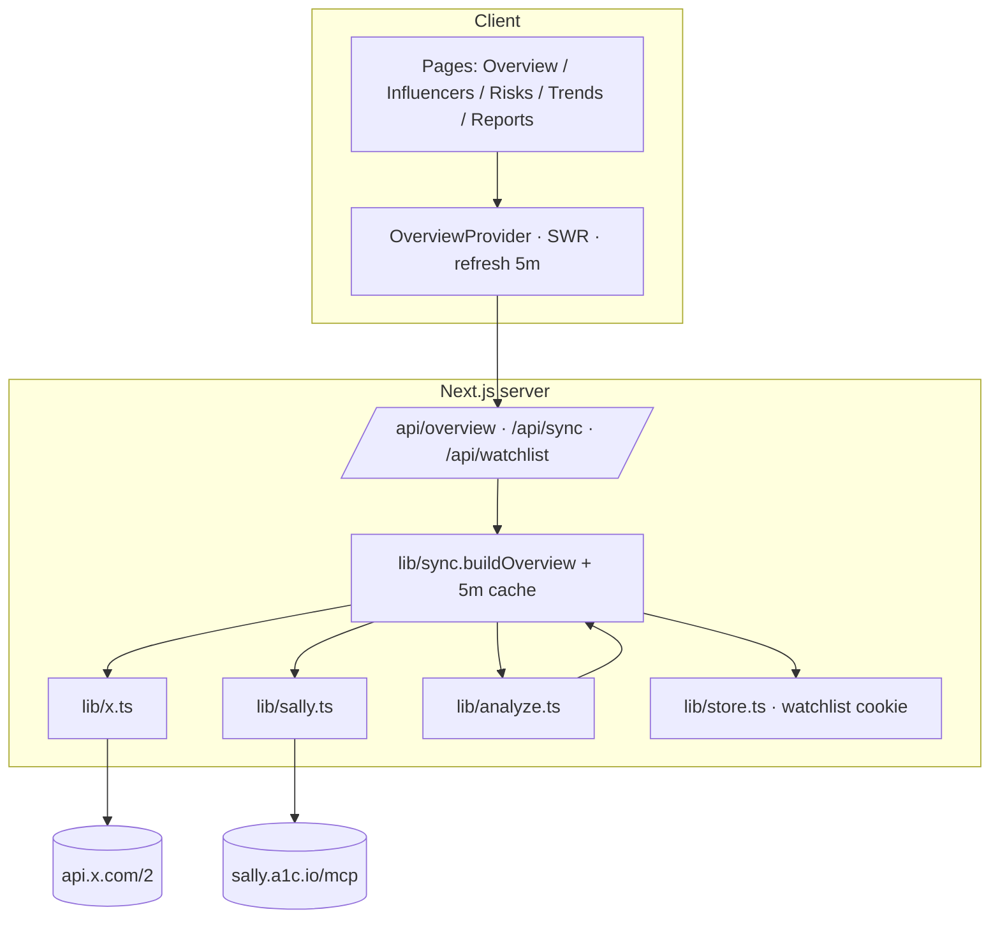
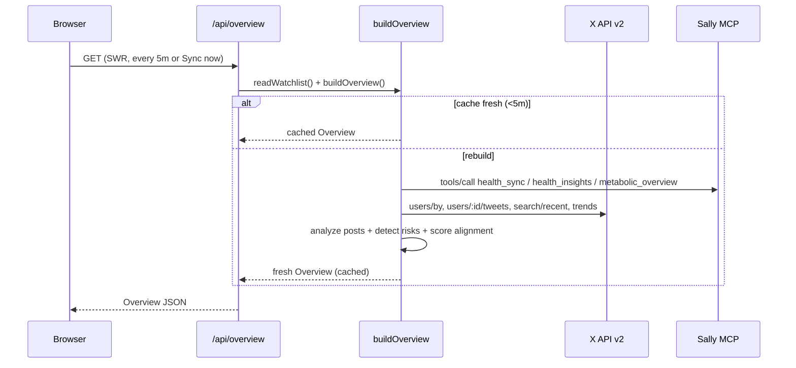

# HealthX-Intel — System Design

## 1. Overview

HealthX-Intel is a single-user Next.js (App Router) dashboard. It composes three independent
capabilities into one cached `Overview` object that the whole UI renders from:

1. **X monitoring** — public reads via the X API v2 (app-only bearer).
2. **Sally biomarkers** — the user's own metabolic/vitals data via the Sally Skills MCP server.
3. **Deterministic analysis** — a rule engine that scores posts/trends and the alignment between
   influencer advice and the user's weak areas.

## 2. Data flow

### Sync sequence

## 3. Module map

| Module | Responsibility |
| --- | --- |
| `lib/config.ts` | Env + tunables. Single source of truth; no hardcoded secrets/thresholds elsewhere. |
| `lib/types.ts` | Domain contracts (`XUser`, `XPost`, `InfluencerAnalysis`, `RiskAlert`, `SallySnapshot`, `Overview`). |
| `lib/x.ts` | X API v2 client. App-only bearer mint + cache (refresh on 401), user/timeline/search/trends. |
| `lib/sally.ts` | Sally MCP-over-HTTP client (`tools/call`), payload mapping, `buildSallySnapshot` + weak-area derivation. |
| `lib/analyze.ts` | Theme taxonomy, red-flag lexicon, post scoring, influencer alignment, risk-alert builder, reference library. |
| `lib/sync.ts` | Orchestrates live X + Sally → `Overview`, graceful per-source fallback, 5-minute cache. |
| `lib/store.ts` | Watchlist persistence (httpOnly cookie) + pure add/remove helpers. |
| `lib/cache.ts` | In-process TTL cache + last-sync clock. |
| `lib/seed.ts` | Real captured profiles + real Sally snapshot used only as fallback (no fabricated posts). |
| `lib/report.ts` | Pure Overview → Markdown report. |
| `components/*` | `OverviewProvider` (SWR context), `Sidebar`, `TopBar`, cards, UI primitives. |

## 4. Scoring methodology

**Post risk (0–100).** Each post is matched against a weighted red-flag lexicon — disease
cure/reversal claims (42), discouraging prescribed meds (40), conspiracy framing (26), miracle/detox
language (20–26), absolutes (9), raw milk (22), unproven GLP-1 alternatives (24), etc. A strong claim
with no linked source adds 8. The sum is clamped to 100; matched labels become the post's flags.

**Influencer alignment (0–100).** Starts at `72 − 0.5 × avgRisk`. For each of the user's Sally weak
areas (e.g. *poor sleep*, *low recovery*, *time-in-range*), the engine adds `+6` per top theme the
account posts about that is relevant to that area (sleep/light/cold/exercise for recovery;
glucose/low-carb/fasting/exercise for metabolic). Clamped 0–100. Every score ships with plain-language
reasons and topic references.

**Risk detection.** A panel of monitored searches (`RISK_QUERIES`) is run each sync; the
highest-scoring post per query above the threshold (28) becomes an alert with severity
high ≥ 55 / medium ≥ 35 / low. Alerts carry the sample post, the matched flags, any relevant
user-data context, and cross-check references.

All scoring is **pure and deterministic** — no LLM at runtime — so results are reproducible and the
app runs entirely within a serverless request.

## 5. API surface

| Route | Method | Purpose |
| --- | --- | --- |
| `/api/overview` | GET | Build (or read cached) `Overview` for the current watchlist. Drives SWR. |
| `/api/sync` | POST | Force a fresh pull past the cache. Returns `{ ok, lastSyncAt, source }`. |
| `/api/watchlist` | GET / POST / DELETE | Read, add, or remove a tracked handle (sets the watchlist cookie). |

## 6. Frontend

- `OverviewProvider` seeds SWR with server-rendered initial data and refreshes every
  `SYNC_INTERVAL_MS`; `TopBar` shows live "last sync" and a manual sync.
- Pages are thin clients over the shared `Overview`: Overview (KPIs + Sally + top risks + history),
  Influencer Monitor (+ detail, add/remove), Risk Alerts, Trends & History, Reports.
- Design tokens (dark palette, Chillax/Clash/Source Code Pro) mirror the A1C `platform-frontend`.

## 7. Cloud portability

The dashboard depends only on HTTPS endpoints (`api.x.com`, `sally.a1c.io/mcp`) and stateless
serverless functions — no provider-specific services — so it runs unchanged on Vercel or any Node
host. The local `xurl mcp` X bridge is intentionally **not** used (it can't run serverless); X is
reached via REST instead.
